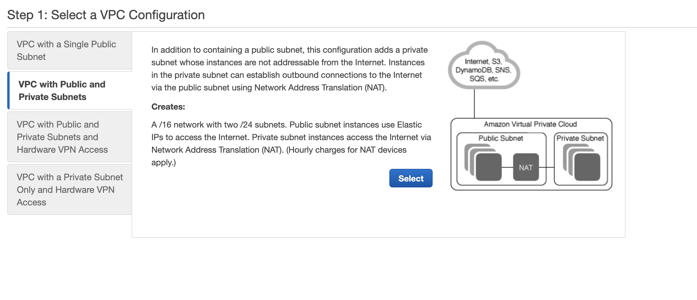
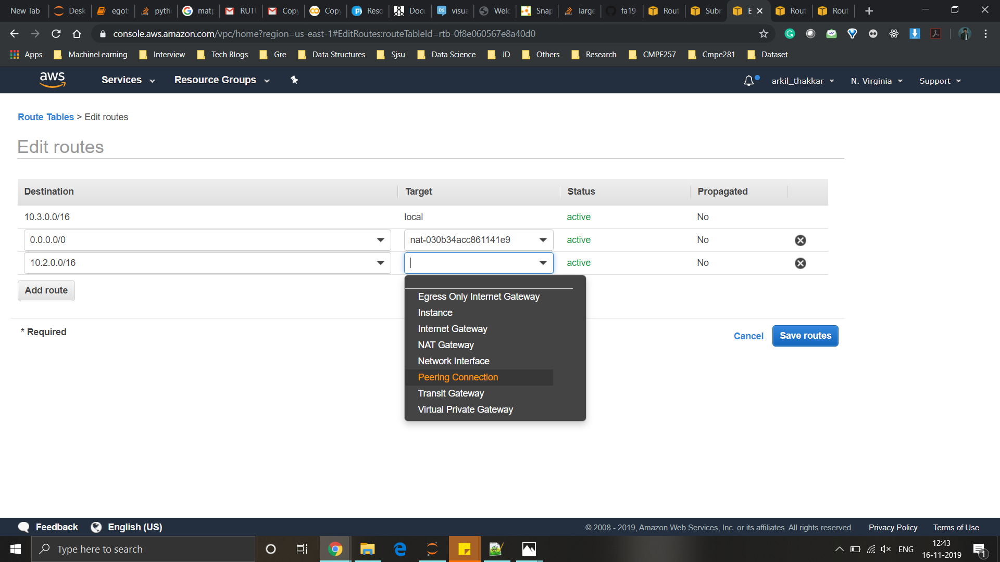
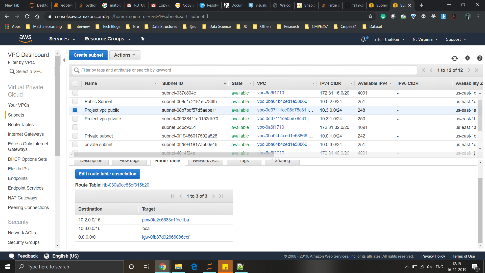
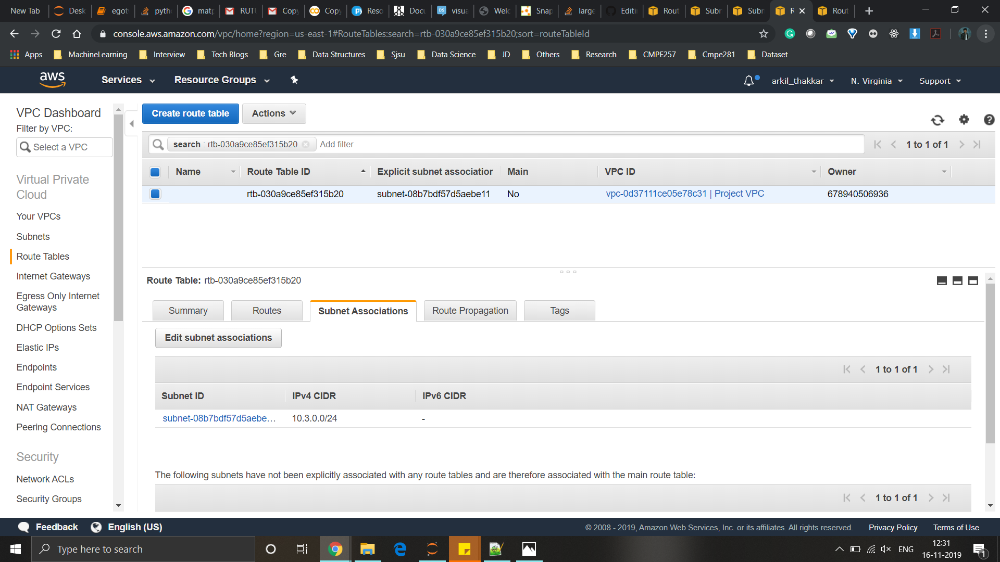

# Instructions on setting up VPC Peering

1. Create a new VPC (e.g: cmpe281-kohra (Do not reuse cmpe281 VPC used for course labs) using the wizard as it won't work and might impact the current setup.

Note: The CIDR blocks for each of our VPCs should be unique for peering to work. 

Vish is using: 10.2.0.0/16
Arkil is using: 10.3.0.0/16

Would suggest below CIDR blocks for others to make it easier:
Saket : 10.4.0.0/16
Varun Jain: 10.5.0.0/16
Varun S: 10.6.0.0/16

2. Next, each of us have to create VPC peering connecting with other 4 VPCs (unless there's no need to connect to a specific VPC) per below.

VPC details for creating peering requests:

|  Name 	  |   Account ID 	| VPC ID   	              |
|-----------|---------------|-------------------------|
|   Vish	  |  466657727551 | vpc-00f6d19f684379e31  	|
|   Arkil	  |  678940506936	| vpc-0d37111ce05e78c31 	                    |
|   Saket   |  892072204237 | vpc-03bb33674b5c9218b   |
|  Varun J	|  771966576901 | vpc-0256cb23f6a42cbe8   |
|  Varun S  |   	          |                         |

3. Once created, an approval request is sent to the accepter who needs to accept it. Once accepted, check the status of VPC peering and it needs to change to "Active".

4. Edit the DNS settings under Actions to enable "Requester DNS resolution"

5. Edit route tables of public subnet. Add CIDR block of other VPC. For ex Vish CIDR: 10.2.0.0/16 as peering connection

 

 

6. Edit route tables of private subnet. Add CIDR block of other VPC. For ex Vish CIDR: 10.2.0.0/16 as peering connection

 

7. Subnet associations of public subnet

 

